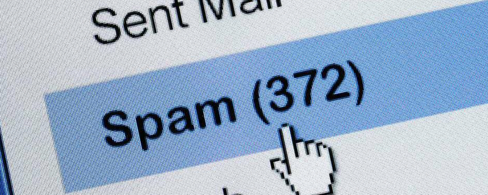

# View Project: 

https://nbviewer.jupyter.org/github/iwasscience/Spamfilter/blob/master/Spamfilter.ipynb

# Spam Classification Project 

## Tools:

Pandas, Numpy, Matplotlib, Seaborn, scikit-learn

## Structure:

**Exploratory Data Analysis**

 - Info Statistics and distribution plots
 
**Data Preprocessing**

 - Train-Test-Split
 - CountVectorizer
 
**Modeling**

 - Multinomial Naive Bayes
 
**Model Evaluation**

 - classification report
 - confusion matrix 
 - accuracy 
 
**Hyperparameter tuning**

 - GridSearchCV
 
**Results showcase**

 - interpreting output
 - function to classify spam

 
 
